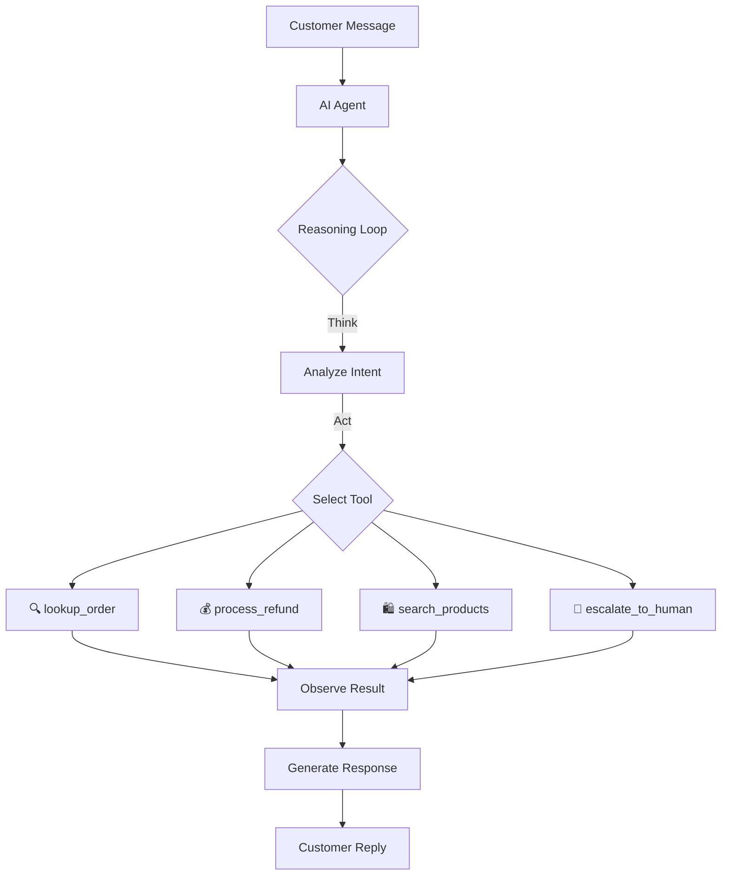

# Business Case: AI-Powered Customer Support Agent

## Executive Summary

**ShopSmart Inc.**, a mid-size e-commerce company processing **50,000 orders/month**,
faces escalating customer support costs and declining satisfaction scores. This document
proposes deploying an AI agent to handle **Tier-1 support** (order inquiries, refunds,
product recommendations) — reducing costs by **60%** while improving response time from
**4 hours to under 10 seconds**.

---

## 1. Problem Statement

### Current Situation

| Metric | Current Value | Industry Benchmark |
|---|---|---|
| Avg. response time | 4 hours | < 1 hour |
| Support cost per ticket | $12.50 | $8.00 |
| Customer satisfaction (CSAT) | 72% | 85% |
| Tickets per month | 15,000 | — |
| Support team size | 25 agents | — |
| Monthly support cost | $187,500 | — |

### Pain Points

1. **High volume of repetitive queries** — 70% of tickets are Tier-1 (order status, refunds, product questions)
2. **Slow response times** — Customers wait 4+ hours during peak periods
3. **Agent burnout** — High turnover (35% annually) due to repetitive work
4. **Scaling challenges** — Hiring and training new agents takes 6-8 weeks

---

## 2. Proposed Solution

Deploy an **AI Customer Support Agent** that autonomously handles Tier-1 interactions
using a **tool-calling architecture**.

### Architecture



### How It Works — The ReAct Pattern

The agent follows a **ReAct** (Reasoning + Acting) loop:

```
1. THINK  → "The customer is asking about order #1001. I should look it up."
2. ACT    → Call lookup_order(order_id="1001")
3. OBSERVE → {status: "shipped", tracking: "FX123456", eta: "March 12"}
4. RESPOND → "Your order #1001 has shipped! Tracking: FX123456, arriving March 12."
```

### Agent Capabilities

| Tool | What It Does | Business Rules |
|---|---|---|
| `lookup_order` | Retrieves order status, items, tracking info | Read-only, any order |
| `process_refund` | Initiates refund for eligible orders | Within 30 days, item not worn/damaged |
| `search_products` | Searches product catalog for recommendations | Uses ratings + relevance scoring |
| `escalate_to_human` | Transfers to human agent | Complex complaints, fraud, legal issues |

---

## 3. ROI Analysis

### Cost Projection (Monthly)

| Category | Before AI Agent | After AI Agent | Savings |
|---|---|---|---|
| Tier-1 tickets (70%) | 10,500 tickets | 0 (handled by AI) | — |
| Tier-2 tickets (30%) | 4,500 tickets | 4,500 + ~500 escalated | — |
| AI agent cost | $0 | $3,000 (API + infra) | — |
| Human agent team | 25 agents ($187,500) | 10 agents ($75,000) | $112,500 |
| **Total monthly cost** | **$187,500** | **$78,000** | **$109,500** |

### Annual Impact

- **Cost savings**: ~$1.3M/year
- **CSAT improvement**: 72% → 90% (projected)
- **Response time**: 4 hours → <10 seconds for Tier-1
- **Agent retention**: Remaining human agents handle complex, rewarding cases

### Break-Even Timeline

| Phase | Duration | Cost | Cumulative |
|---|---|---|---|
| Development | Month 1-2 | $40,000 | $40,000 |
| Pilot (10% traffic) | Month 3 | $5,000 | $45,000 |
| Rollout (100% traffic) | Month 4+ | $3,000/mo | — |
| **Break-even** | **Month 5** | — | **Recovered** |

---

## 4. Implementation Roadmap

### Phase 1: Build & Test (Weeks 1-4)
- Build agent tools (order lookup, refund processing, product search)
- Implement ReAct reasoning loop
- Test with historical support tickets
- Measure accuracy on 500 test conversations

### Phase 2: Pilot (Weeks 5-8)
- Deploy to 10% of incoming support traffic
- Human agents review all AI responses
- Refine prompts based on edge cases
- Target: 90% resolution accuracy

### Phase 3: Scale (Weeks 9-12)
- Expand to 100% of Tier-1 traffic
- Add monitoring dashboard (resolution rate, escalation rate, CSAT)
- Reduce human team from 25 → 10

### Phase 4: Optimize (Ongoing)
- Fine-tune on company-specific data
- Add new tools (shipping updates, account changes)
- Implement proactive outreach (delivery delays, restock notifications)

---

## 5. Risk Mitigation

| Risk | Likelihood | Mitigation |
|---|---|---|
| AI gives wrong answer | Medium | Confidence thresholds + human review for uncertain responses |
| Customer frustration with AI | Low | Easy "talk to human" option, transparent AI disclosure |
| Data privacy concerns | Low | No PII in model training, SOC2 compliant infrastructure |
| Hallucination in responses | Medium | Tool-grounded responses (agent only uses data from tools, not memory) |

---

## 6. Success Metrics (KPIs)

1. **Resolution Rate** — % of tickets fully resolved without human intervention (target: 85%)
2. **Escalation Rate** — % of tickets escalated to humans (target: <15%)
3. **Customer Satisfaction** — CSAT score for AI-handled tickets (target: 88%+)
4. **Average Handle Time** — Time from first message to resolution (target: <2 minutes)
5. **Cost per Ticket** — All-in cost for AI-handled tickets (target: <$1.50)

---

## 7. Conclusion

By deploying an AI customer support agent, ShopSmart Inc. can:
- **Save $1.3M annually** in support costs
- **Respond instantly** to 70% of customer inquiries
- **Free human agents** to handle complex, high-value interactions
- **Scale effortlessly** during peak periods (Black Friday, holidays)

The technology is proven, the ROI is clear, and the risk is manageable. This project
demonstrates how to build such an agent from scratch.
