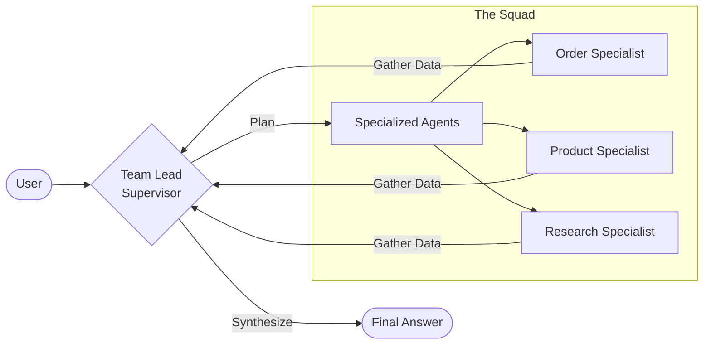

# 🤖 SuperShop AI: Multi-Agent E-Commerce Orchestrator

A professional-grade AI Agent system demonstrating a **Multi-Agent Orchestration** pattern using **LangGraph**, **Hybrid LLM Support (Ollama/Gemini)**, and **PostgreSQL**.

## 🏗 System Architecture

The application is built using a modern, containerized microservices architecture with local-first capabilities:



### 🔹 1. Collective Thinking Orchestration

Unlike traditional linear routers, our **Team Lead Supervisor** uses a circular cycle:

- **Sequential Planning**: Can call multiple specialists in a single turn.
- **Cross-Agent Knowledge**: The Research Agent's sentiment findings can inform the Product Agent's recommendations.
- **Unified Synthesis**: Only the Supervisor writes the final response, ensuring a consistent brand voice.

### 🔹 1. Premium Frontend (`ui/`)

- **Tech**: React 18, Vite, TypeScript, Tailwind CSS.
- **Features**: Production-ready design system with real-time message streaming.

### 🔹 2. Intelligence Layer (`backend/`)

- **Vector-Enabled RAG**: Deep retrieval of customer reviews using **ChromaDB** and **Google Gemini Embeddings**.
- **Research Specialist**: A new agent dedicated to sentiment analysis and product issue discovery via vector search.
- **Session Persistence**: Multi-turn memory using LangGraph checkpointers (stateful conversations).

### 🔹 3. 🎓 AI Learning Curriculum (`lessons/`)

- **8-Module Course**: A comprehensive curriculum covering everything from LLM basics (Tokens, Temperature) to advanced Agentic patterns (ReAct, LangGraph Orchestration, RAG, and Evaluation).
- **Code-Linked Theory**: Every lesson is directly connected to the source code in this repository.

### 🔹 4. Persistent Data (`db/`)

- **Triple-Database Architecture**:
  - **Structured Data**: Uses **PostgreSQL** (Docker) or **SQLite** for relational data (Orders, Products).
  - **Semi-Structured Content**: Uses **ChromaDB** for storing and chunking product reviews.
  - **Conversational State**: Uses a separate persistence layer for LangGraph checkpoints.
- **Analytical Seeding**: High-quality mock data and synthetic reviews designed to test RAG and data-driven reasoning.

---

## 🚀 How to Try It Yourself

### Prerequisites

- [Docker](https://www.docker.com/products/docker-desktop/) & Docker Compose installed.

### Setup Instructions

1. **Configure LLM Provider**:
    Open `backend/config.yml` to choose your provider:

    **Option A: Cloud (Recommended)**

    ```yaml
    llm_provider: "gemini"
    gemini_api_key: "YOUR_KEY"
    gemini_model: "gemini-flash-latest"
    ```

    **Option B: Local**

    ```yaml
    llm_provider: "ollama"
    ollama_model: "llama3.2"
    ```

2. **Launch the System**:

    ```bash
    docker compose up --build
    ```

3. **Access the App**:
    - **UI**: [http://localhost:5173](http://localhost:5173)
    - **API Docs**: [http://localhost:8000/docs](http://localhost:8000/docs)
    - **Curriculum**: Start with [lessons/syllabus.md](lessons/syllabus.md)

### Example Scenarios to Try

#### 🔍 Specific Product Specs

- "What are the specs for the Titan gaming laptop? I'm worried about the battery."

#### 📊 Data-Driven Proof

- "What is your current best seller?" -> (Routes to Order Agent for analytics)
- "How many units have you sold of the SoundMax Wireless Headphones?"

#### 📦 Order & Support

- "Where is my order #1005?"
- "I want to return my SoundMax headphones, what's my status?"

#### 🧠 Semantic Research (RAG)

- "What do people generally complain about regarding the SoundMax headphones?"
- "Is the Titan gaming laptop's keyboard considered good for typing?"

#### 🧠 Multi-Agent Synthesis (Collective Thinking)

- "What is our best-selling laptop, and do customers like it? Recommend it if it fits a $2000 budget."
  - *Orchestrates Order Agent (Sales), Research Agent (Sentiment), and Product Agent (Catalog) in one turn.*

---

## 🏗 Project Architecture & Workflow

The system follows a strict **Separation of Concerns**:

1. **`db` & `chroma`**: Pure data engines.
2. **`seeder`**: Automated "Init" service that populates data then exits.
3. **`backend`**: Stateless API server.
4. **`ui`**: Modern React frontend.

---

## 📁 Project Structure

```
.
├── docker-compose.yml       # Orchestration for the complete stack
├── docker/                  # 🐳 Centralized Dockerfiles for all services
│   ├── backend/
│   ├── ui/
│   ├── db/
│   └── chroma/
├── lessons/                 # 🎓 Complete 8-Module AI Agent Curriculum
├── backend/
│   ├── config.yml           # Provider toggles & Model settings
│   ├── src/
│   │   ├── agents/          # Specialized Agent logic (Product, Order, Research, Supervisor)
│   │   ├── db/              # SQL models, Vector Store logic, and Seeding scripts
│   │   └── graph.py         # LangGraph Orchestration & Persistence
└── ui/
    ├── src/                 # React components and Chat UI
```

### 🛠 Seeding Data

#### **Option A: Automated Seeding (Default)**

When you run `docker compose up`, the `seeder` service automatically populates all data and then shuts down once complete. No manual action is required!

#### **Option B: Force Re-seed (Docker)**

If you need to refresh the data while the containers are running:

```bash
# Seed SQL Database
docker compose exec backend python3 src/db/seed_db.py

# Seed Vector Database
docker compose exec backend python3 src/db/seed_vector_db.py
```

#### **Option B: Manual Seeding (Local)**

If running scripts outside of Docker, use:

```bash
# Seed SQL product data
python3 backend/src/db/seed_db.py

# Seed Vector reviews (requires GOOGLE_API_KEY)
export PYTHONPATH=$PYTHONPATH:$(pwd)/backend
python3 backend/src/db/seed_vector_db.py
```

## License

MIT
