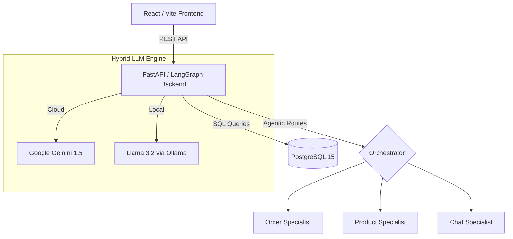

# 🤖 SuperShop AI: Multi-Agent E-Commerce Orchestrator

A professional-grade AI Agent system demonstrating a **Multi-Agent Orchestration** pattern using **LangGraph**, **Hybrid LLM Support (Ollama/Gemini)**, and **PostgreSQL**.

## 🏗 System Architecture

The application is built using a modern, containerized microservices architecture with local-first capabilities:



### 🔹 1. Premium Frontend (`ui/`)

- **Tech**: React 18, Vite, TypeScript, Tailwind CSS.
- **Features**: Production-ready design system with real-time message streaming.

### 🔹 2. Intelligence Layer (`backend/`)

- **Hybrid LLM Support**: Toggle between cloud (Gemini) and local (Ollama) providers via configuration.
- **LangGraph Orchestrator**: Uses a **Supervisor Pattern** to route user intent to specialized agents.
- **Product Knowledge Enrichment**: Deep technical specs, warranties, brand data, and customer reviews.
- **Normalization**: Robust handlers for stable tool-calling across varying model sizes.

### 🔹 3. Persistent Data (`db/`)

- **PostgreSQL 15**: Enterprise-grade persistence.
- **Auto-Seeding**: High-quality mock products and historical data populated automatically on startup.

---

## 🚀 How to Try It Yourself

### Prerequisites

- [Docker](https://www.docker.com/products/docker-desktop/) & Docker Compose installed.

### Setup Instructions

1. **Configure LLM Provider**:
    Open `backend/config.yml` to choose your provider:

    **Option A: Local (Default)**

    ```yaml
    llm_provider: "ollama"
    ollama_model: "llama3.2"
    ```

    **Option B: Cloud**

    ```yaml
    llm_provider: "gemini"
    gemini_api_key: "YOUR_KEY"
    ```

2. **Launch the System**:

    ```bash
    docker-compose up --build
    ```

3. **Access the App**:
    - **UI**: [http://localhost:5173](http://localhost:5173)
    - **API Docs**: [http://localhost:8000/docs](http://localhost:8000/docs)

### Example Scenarios to Try

#### 🔍 Specific Product Specs

- "What are the specs for the Titan gaming laptop? I'm worried about the battery."
- "Does the ProBook Laptop 15 have an i9 processor?"

#### ⭐️ Customer Feedback

- "What do people think about the SoundMax headphones? Are they comfortable?"
- "Show me the reviews for the ErgoDesk standing desk."

#### 📦 Order & Support

- "Where is my order #1005?"
- "I want to return my SoundMax headphones, what's my status?"

---

## 📁 Project Structure

```
.
├── docker-compose.yml       # Orchestration for Backend, UI, Postgres, and Ollama
├── backend/
│   ├── config.yml           # Provider toggles & Model settings
│   ├── src/
│   │   ├── agents/          # Specialized Agent logic & Tool definitions
│   │   ├── db/              # Postgres models and Enriched Seeding logic
│   │   └── graph.py         # LangGraph Supervisor logic
└── ui/
    ├── src/                 # React components and chat UI
```

## License

MIT
