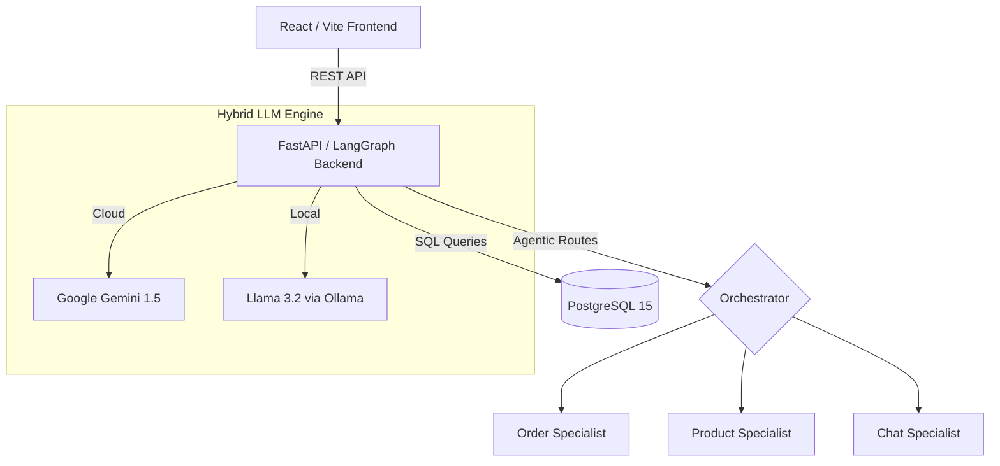

# 🤖 SuperShop AI: Multi-Agent E-Commerce Orchestrator

A professional-grade AI Agent system demonstrating a **Multi-Agent Orchestration** pattern using **LangGraph**, **Hybrid LLM Support (Ollama/Gemini)**, and **PostgreSQL**.

## 🏗 System Architecture

The application is built using a modern, containerized microservices architecture with local-first capabilities:



### 🔹 1. Premium Frontend (`ui/`)

- **Tech**: React 18, Vite, TypeScript, Tailwind CSS.
- **Features**: Production-ready design system with real-time message streaming.

### 🔹 2. Intelligence Layer (`backend/`)

- **Hybrid LLM Support**: Toggle between cloud (Gemini) and local (Ollama) providers via configuration.
- **LangGraph Orchestrator**: Uses a **Supervisor Pattern** to route user intent to specialized agents.
- **Product & Sales Analytics**: Real-time sales data and popularity tracking to back up product recommendations.
- **Session Persistence**: Multi-turn memory using LangGraph checkpointers (stateful conversations).

### 🔹 3. 🎓 AI Learning Curriculum (`lessons/`)

- **8-Module Course**: A comprehensive curriculum covering everything from LLM basics (Tokens, Temperature) to advanced Agentic patterns (ReAct, LangGraph Orchestration, RAG, and Evaluation).
- **Code-Linked Theory**: Every lesson is directly connected to the source code in this repository.

### 🔹 4. Persistent Data (`db/`)

- **PostgreSQL 15**: Enterprise-grade persistence for products, orders, and sessions.
- **Analytical Seeding**: High-quality mock data designed to test data-driven reasoning (e.g., finding the "best selling" items).

---

## 🚀 How to Try It Yourself

### Prerequisites

- [Docker](https://www.docker.com/products/docker-desktop/) & Docker Compose installed.

### Setup Instructions

1. **Configure LLM Provider**:
    Open `backend/config.yml` to choose your provider:

    **Option A: Cloud (Recommended)**

    ```yaml
    llm_provider: "gemini"
    gemini_api_key: "YOUR_KEY"
    gemini_model: "gemini-flash-latest"
    ```

    **Option B: Local**

    ```yaml
    llm_provider: "ollama"
    ollama_model: "llama3.2"
    ```

2. **Launch the System**:

    ```bash
    docker-compose up --build
    ```

3. **Access the App**:
    - **UI**: [http://localhost:5173](http://localhost:5173)
    - **API Docs**: [http://localhost:8000/docs](http://localhost:8000/docs)
    - **Curriculum**: Start with [lessons/syllabus.md](lessons/syllabus.md)

### Example Scenarios to Try

#### 🔍 Specific Product Specs

- "What are the specs for the Titan gaming laptop? I'm worried about the battery."

#### 📊 Data-Driven Proof

- "What is your current best seller?" -> (Routes to Order Agent for analytics)
- "How many units have you sold of the SoundMax Wireless Headphones?"

#### 📦 Order & Support

- "Where is my order #1005?"
- "I want to return my SoundMax headphones, what's my status?"

#### 🧠 Persistence (Context)

1. Ask: "Tell me about the SoundMax headphones."
2. Follow up: "Do you have any in stock?" (Agent remembers you are talking about SoundMax).

---

## 📁 Project Structure

```
.
├── docker-compose.yml       # Orchestration for Backend, UI, Postgres, and Ollama
├── lessons/                 # 🎓 Complete 8-Module AI Agent Curriculum
├── backend/
│   ├── config.yml           # Provider toggles & Model settings
│   ├── src/
│   │   ├── agents/          # Specialized Agent logic (Product, Order, Supervisor)
│   │   ├── db/              # Postgres models and Analytical Seeding logic
│   │   └── graph.py         # LangGraph Orchestration & Persistence
└── ui/
    ├── src/                 # React components and Chat UI
```

## License

MIT
