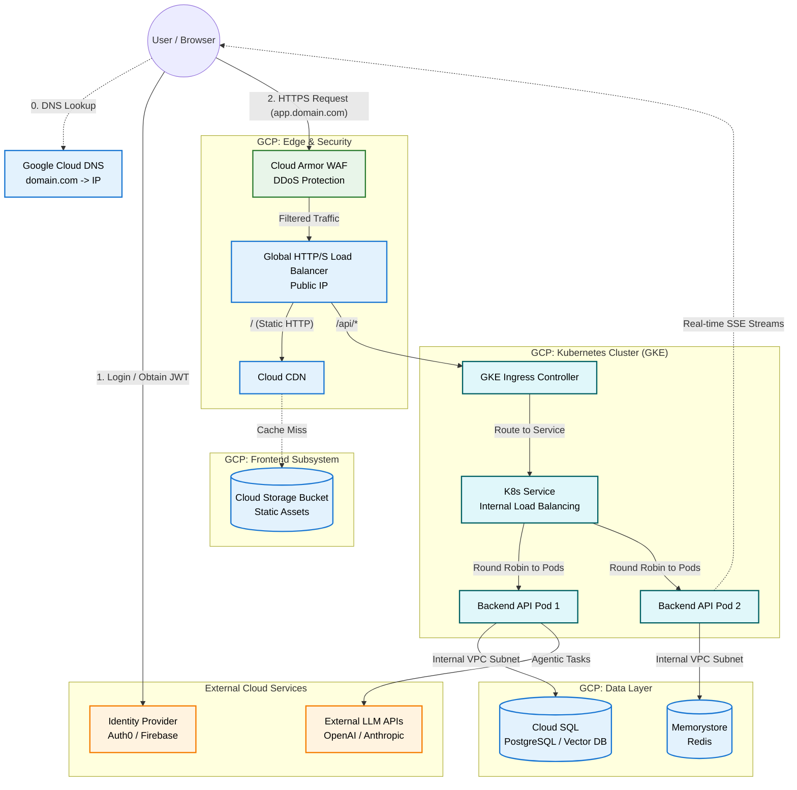

# Enterprise Full-Stack Web Application Architecture

This document outlines the end-to-end system design for deploying a decoupled Client-Side Rendered (CSR) frontend and a containerized backend microservices architecture. It is tailored for a Director of Engineering (AI/ML) technical interview, focusing on scalability, security, resilience, and enterprise-grade deployment patterns using Google Kubernetes Engine (GKE).

## 1. End-to-End Architecture Diagram

The following diagram illustrates the flow of a user interacting with the system, highlighting the Kubernetes overlay network, external DNS resolution, and the security boundaries.



## 2. High-Level Architecture Overview

In this decoupled architecture, the frontend and backend are strictly separated. This pattern provides independent scaling metrics and isolates the "blast radius" (a frontend bug will never crash the backend).

### Component Justifications
- **Identity Provider (IdP):** Auth0 or Firebase Auth. *Director Insight:* Offloading identity management reduces legal compliance risks (SOC2/GDPR) and delegates password hashing, MFA, and SSO integrations to dedicated security experts.
- **Frontend Hosting:** GCS Bucket heavily cached by Cloud CDN. *Director Insight:* Serving static files via Node.js is an anti-pattern. An object store coupled with a CDN is infinitely scalable, completely serverless, and resilient to localized data center outages.
- **Backend Infrastructure:** Google Kubernetes Engine (GKE). *Director Insight:* GKE provides the ability to run diverse workloads (CPU-bound APIs alongside GPU-bound local LLM workers) within the same cluster. It also seamlessly supports complex routing via Service Meshes (like Istio) for Zero-Trust internal networking.
- **Data Layer:** Cloud SQL (PostgreSQL with `pgvector` for RAG capabilities) and Memorystore (Redis for high-speed agentic memory/caching).

---

## 3. Networking & Security at the Edge

A robust enterprise network abstracts raw IPs internally and heavily shields the perimeter.

### 3.1 External DNS and The Perimeter (WAF)
1. **Google Cloud DNS:** Maps the human-readable `app.mycompany.com` to a static Public IP using an A-Record.
2. **Cloud Armor (WAF):** Before hitting the Load Balancer, traffic passes through a Web Application Firewall. *Director Insight:* This filters out SQL injection attempts, cross-site scripting (XSS), and actively rate-limits abusive IP addresses to mitigate Layer 7 DDoS attacks.
3. **Global Load Balancer:** Terminates the SSL/TLS connection utilizing Google-managed certificates, offloading the heavy cryptographic burden from the backend application pods.

### 3.2 Internal Kubernetes DNS & Service Mesh
Inside GKE, Pod IP addresses change dynamically due to autoscaling or crashes, and they are purely private—meaning they cannot be accessed from the internet.
1. **Kubernetes Services:** Resources are assigned an internal load balancer (a K8s `Service`) which maintains a highly stable, human-readable internal URL (e.g., `http://backend-api.default.svc.cluster.local`) and an internal Private IP.
2. **CoreDNS:** Instantly resolves this domain name to the Service's internal IP.
3. **Advanced - Service Mesh:** For high organizational security, an Istio sidecar proxy can be attached to every pod to enforce mTLS (Mutual TLS)—meaning internal traffic between the API and the Database is strictly mathematically encrypted, preventing eavesdropping even if the internal network is breached.

### 3.3 The Ingress Bridge (Public to Private Flow)
How does traffic transition from a public human-readable domain to a hidden private container?

1. **The Public Perimeter (Ports 80/443):** The user types `app.mycompany.com`. GCP Cloud DNS resolves this to the **Static Public IP** attached to the Global Load Balancer. This Load Balancer is the only component exposed to the internet, listening strictly on `Port 443` (HTTPS) and decrypting the SSL traffic.
2. **The Kubernetes Ingress:** GCP reads your declarative K8s `Ingress.yaml` file. The Ingress maps URL paths to internal services. It says: *"If the path is `/api/*`, forward the decrypted traffic to `backend-api-service`."*
3. **The Private Subnet Translation:** The `backend-api-service` acts as a bridge. It receives the traffic on an internal port (e.g., `Port 80`) and routes it deep into the Virtual Private Cloud (VPC), hitting the exact **Private IP** and **Private Port** (e.g., `8080`) of the running Docker container. 
*Director Insight:* This topology is highly secure because your application servers never have Public IPs. They are physically incapable of being attacked directly from the internet.

---

## 4. Concrete CI/CD Lifecycle & Observability

In an enterprise environment, developers do not use `kubectl` manually. We rely on automated, declarative pipelines.

### 4.1 Deploying the Backend to GKE via Cloud Build
```yaml
# A declarative cloudbuild.yaml snippet
steps:
  - name: 'gcr.io/cloud-builders/docker'
    args: ['build', '-t', 'us-central1-docker.pkg.dev/$PROJECT_ID/repo/api:$COMMIT_SHA', '.']
  - name: 'gcr.io/cloud-builders/docker'
    args: ['push', 'us-central1-docker.pkg.dev/$PROJECT_ID/repo/api:$COMMIT_SHA']
  - name: 'ubuntu' # Sed swaps the placeholder tag for the SHA in the deployment manifest
    args: ['sed', '-i', 's|IMAGE_PLACEHOLDER|...:$COMMIT_SHA|g', 'k8s/deployment.yaml']
  - name: 'gcr.io/cloud-builders/kubectl'
    args: ['apply', '-f', 'k8s/'] # Deploys updated manifests to GKE
```

### 4.2 Mature Deployment Strategies & Telemetry
- **GitOps (ArgoCD):** Instead of Cloud Build pushing directly to GKE, ArgoCD *pulls* changes from a manifest repository. If an engineer manually tampers with the cluster, ArgoCD automatically overwrites it, ensuring the cluster strictly matches the Git history.
- **Canary Deployments:** The Load Balancer routes only 5% of live traffic to the new containers. If native telemetry via Cloud Monitoring (formerly Stackdriver) detects increased 5xx HTTP errors or high latency, the deployment automatically rolls back to the previous stable state without human intervention.

---

## 5. Communication Architecture & Patterns

### 5.1 Unifying Domains (Overcoming CORS)
Browsers actively enforce strict Cross-Origin Resource Sharing (CORS). A **GKE Ingress Resource** elegantly bypasses this at the load balancer level:
- `app.mycompany.com/*` -> Routes via BackendConfig to the Cloud Storage Bucket.
- `app.mycompany.com/api/*` -> Routes deeper into the internal K8s Service.
*Director Insight:* By mapping disparate microservices under a single external domain, frustrating browser security policies are satisfied natively.

### 5.2 Real-Time AI Streaming Resilience
Standard REST is fundamentally inadequate for LLM token streaming.
- **Server-Sent Events (SSE):** The frontend opens a unidirectional stream (`/api/stream`).
- **Resilience Strategy:** Mobile networks drop connections frequently. The frontend must implement automatic retry logic. When reconnecting via SSE, the frontend passes the `last_event_id` back to the server so the AI orchestrator knows precisely where the LLM generation was abruptly cut off, preventing duplicate or skipped text generations.

---

## 6. Enterprise Authentication and Authorization (Auth)

Decoupled architectures require completely stateless tokenization.

### 6.1 Token Lifecycle Flow
1. **Login:** The user authenticates against Auth0/Firebase.
2. **Access Token:** The frontend receives a short-lived JSON Web Token (JWT, valid for ~15 mins).
3. **Refresh Token:** To prevent forcing the user to log in repeatedly, a secure `HttpOnly` cookie containing a Refresh Token is issued. The frontend silently exchanges this for a highly secure, fresh JWT when the old one expires.

### 6.2 Backend Authorization Enforcement
For every API call, the frontend attaches the JWT (`Authorization: Bearer <token>`). The backend validates the cryptographic signature using the IdP's cached public JSON Web Key Set (JWKS). Because this relies on math, it requires absolute zero database lookups—unlocking massive global API throughput.

### 6.3 State Context vs. Identity (Preventing IDOR)
With AI applications like LangGraph, requests require both **Identity** (who the user is) and **State** (which conversation thread is active).

- **Identity (JWT Header):** Securely proves `user_id=123`.
- **State (JSON Body):** The frontend requests `{"thread_id": "conv_987"}`.

**Security Control:** To prevent catastrophic Insecure Direct Object Reference (IDOR) vulnerabilities, the backend never trusts the JSON body blindly. It intercepts both variables and queries the database: *"Does `thread_id=conv_987` securely belong to `user_id=123`?"*
Only if mathematically validated will the backend inject the `thread_id` into the LangGraph state. Otherwise, a `403 Forbidden` is triggered, instantly halting potential cross-tenant data leaks.

---

## 7. Multi-Tenant Data Isolation (Defense in Depth)

In a multi-tenant SaaS application, user data (e.g., banking details, AI chat histories) lives in the same shared database tables. We must guarantee that a user can *only* read or modify their own data.

### 7.1 Application-Level Filtering (The Standard Approach)
Typically, the backend extracts the `user_id` from the JWT and manually applies it to every SQL query:
`SELECT * FROM accounts WHERE user_id = 'user_123';`
*The Flaw:* If a tired engineer forgets the `WHERE` clause, a massive data breach occurs. This relies solely on application logic for security.

### 7.2 Row-Level Security (RLS) in PostgreSQL (The Enterprise Approach)
To achieve true "Defense in Depth", we lock down the data at the Database Engine level using Cloud SQL (PostgreSQL). We implement **Row-Level Security (RLS)**.

With RLS, the database intercepts the query and enforces security policies *before* returning data. Even if a developer writes a vulnerable `SELECT * FROM accounts;`, the database will mathematically refuse to return records that do not belong to the user.

#### Implementation Workflow on Cloud SQL
1. **Enable RLS on the Table:**
   ```sql
   ALTER TABLE accounts ENABLE ROW LEVEL SECURITY;
   ```
2. **Create the Universal Security Policy:**
   We strictly define a rule that the `user_id` column of the row must match a predefined session variable.
   ```sql
   CREATE POLICY tenant_isolation_policy ON accounts
       USING (user_id = current_setting('app.current_tenant')::uuid);
   ```
3. **The Backend Execution Flow:**
   When the Node/FastAPI backend receives an API request, it does the following within a single atomic database transaction:
   - Sets the database session variable using the validated JWT ID:
     `SET LOCAL app.current_tenant = 'user_123';`
   - Executes the developer's naive query:
     `SELECT * FROM accounts;`
   - *Result:* PostgreSQL automatically applies the policy, acting as if the developer wrote `WHERE user_id = 'user_123'`, returning only that specific user's data.

*Director Insight:* RLS completely removes the human-error element from data isolation. If an orchestrating AI agent generates a hallucinated SQL query attempting to read the entire database, the database engine simply blocks it, protecting your entire customer base natively.

---

## 8. Enterprise GitOps Monorepo Structure (Code + Infrastructure)

While the production architecture is distributed, enterprise teams often manage the application code and the Infrastructure as Code (IaC) side-by-side. This demonstrates how Kubernetes manifests, CI/CD pipelines, and application source code coexist to enable the GitOps flow discussed earlier.

### The Enterprise Repository Layout

```text
enterprise_ai_platform/
├── cloudbuild.yaml          # The declarative CI/CD pipeline (Docker build, K8s inject)
├── .github/workflows/       # Alternative: GitHub Actions pipeline definitions
│
├── /k8s-manifests           # The "State of the Cluster" (GitOps Source of Truth)
│   ├── deployment.yaml      # Defines the Backend ReplicaSets and Docker Image tag
│   ├── service.yaml         # Internal networking bridge (Private IP routing)
│   ├── ingress.yaml         # The GCP Load Balancer configuration and CORS routing
│   └── rls-policies.sql     # Database Row-Level Security definitions
│
├── /backend-api             # The Dockerized AI Engine (Python/FastAPI/Go)
│   ├── Dockerfile           # Multi-stage build for minimal container size
│   ├── src/                 # Web server, LangGraph agents, JWT validation logic
│   └── requirements.txt     # Dependency manifest
│
└── /frontend-csr            # The static UI assets (React/Vite)
    ├── package.json         # Build scripts -> outputs to a /dist directory
    ├── src/                 # Component logic and SSE streaming reconnection handlers
    └── public/              # Assets to be pushed to the Cloud Storage Bucket
```

*Director Insight:* This structure explicitly separates **Implementation (Code)** from **Infrastructure State (Manifests)**. In a mature GitOps environment like ArgoCD, an automated tool continuously watches the `/k8s-manifests` folder. If a developer needs to scale from 3 to 10 pods, they don't run commands manually; they issue a Pull Request modifying `deployment.yaml`. Once merged, the cluster updates automatically, leaving a perfect compliance audit trail.
