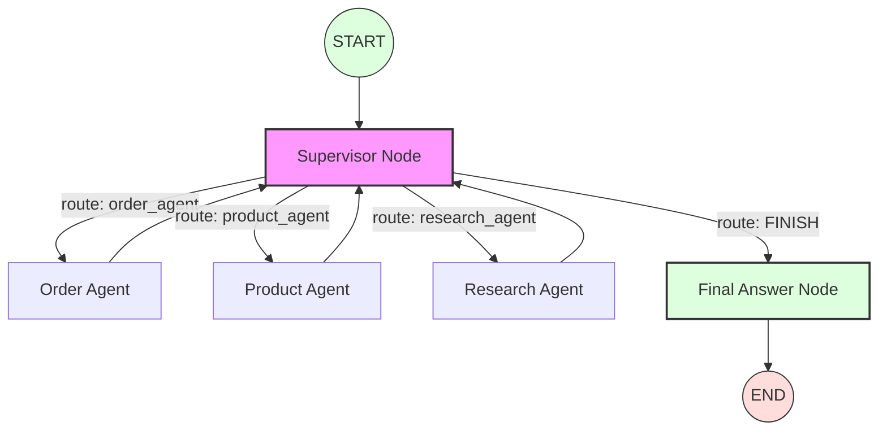

# Lesson 5.2: Decision Nodes & Routing

*The Traffic Controller of the Agent Team*

## Introduction

If you have five specialized agents, how does the system know which one should talk next? In LangGraph, we solve this using **Nodes** (the brain) and **Edges** (the path).

---

## 1. What is a Node?

A Node is just a Python function that takes the current **State**, does some work, and returns an updated State.

**In our code (`backend/src/graph.py`):**

```python
def supervisor_node(state: AgentState) -> Dict:
    # 1. Analyze the context
    # 2. Decide the next agent (Product, Order, or Finish)
    # 3. Return the choice
    ...
```

---

## 2. Conditional Edges: The Choice

Routing happens at the **Edges**. A "Normal Edge" always goes to the next node. A **Conditional Edge** uses a function to decide the path at runtime.

**In our code (`backend/src/graph.py`):**

```python
# The graph structure
workflow.add_conditional_edges(
    "supervisor",
    lambda x: x["next"], # Go where the supervisor decided 'next' should be
    {
        "product_agent": "product_node",
        "order_agent": "order_node",
        "FINISH": END
    }
)
```

---

## 🛠️ In Our Project: The Supervisor Pattern

We use the **Supervisor Pattern**. One "Manager" LLM (the Supervisor) oversees the conversation.

### Visualizing the Flow



- If you ask about a price → Supervisor sends you to the **Product Node**.
- If you ask where your package is → Supervisor sends you to the **Order Node**.
- If the question involves customer sentiment → Supervisor sends you to the **Research Node**.
- If the question is answered → Supervisor sends the conversation to **Final Answer Node** to prepare the response, then **END**.

---

## 3. Why this is better than "If/Else"

Traditional code uses `if/else` statements that are hard-coded. LangGraph routing is **dynamic**. The LLM decides the path based on the *meaning* of the conversation, not just keywords.

---

## Summary

Decision nodes and routing allow you to build branching logic that feels natural. By separating the "Doing" (Specialized Agents) from the "Deciding" (Supervisor), you make your system easier to debug and scale.

> [!CAUTION]
> **Infinite Loops**: Always ensure your routing logic has a "FINISH" path. Without it, your supervisor might keep routing messages back and forth forever!
