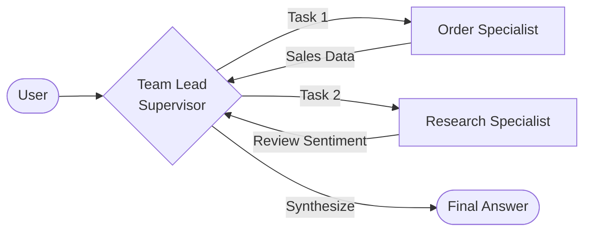

# Lesson 5.3: Multi-Agent Teams & Circular Orchestration

In this lesson, we explore how to move beyond simple routing to building a highly collaborative **team** of agents using circular orchestration.

## 1. The Power of Specialization

Why build many small agents instead of one giant agent? **Specialization**.
Just as a hospital has different specialists, a multi-agent system uses different AIs for different business functions:

- **Focused Prompts**: Detailed instructions that only apply to one job.
- **Specific Tools**: Only the tools and permissions it actually needs.
- **Reduced Hallucinations**: Smaller scopes lead to higher accuracy.

---

## 2. From Linear Routing to Circular Teams

In a basic system, a **Supervisor** acts like a switchboard:

1. User asks a question -> Supervisor picks **one** agent -> Agent answers.

### The "Collective Thinking" Pattern

For complex queries like *"Recommend a popular laptop with good reviews,"* our system now uses a **Circular Team Flow**:

1. **The Team Lead (Supervisor)**: acts as a project manager, reviewing findings after every agent turn and deciding if more data is needed.
2. **The Synthesis Layer**: Once all data is gathered, the Supervisor (SmartBot) synthesizes the technical findings into one cohesive, human-readable response.
3. **Cross-Agent Context**: Every agent shares the same conversation history, allowing them to build on each other's work.

---

## 🛠️ Our Team Members

1. **Order Agent (The Accountant)**: SQL Specialist. Provides sales analytics and tracking data.
2. **Product Agent (The Marketer)**: Catalog Specialist. Compares features and prices for recommendations.
3. **Research Agent (The Analyst)**: Vector & Web Specialist. Analyzes broad customer sentiment and market trends.

## Summary

Multi-agent collaboration is about **orchestration**. By dividing labor and allowing agents to return results to a central lead for synthesis, we create a system that is more accurate, professional, and capable of handling multi-faceted business questions.
