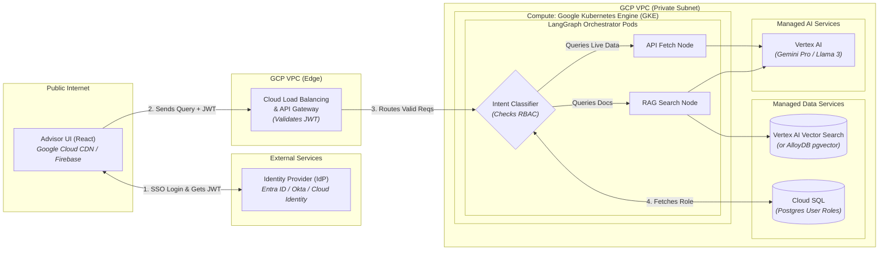
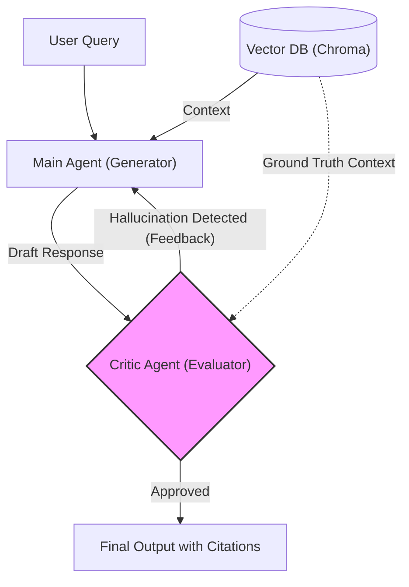

# Enterprise AI System Design Architecture

This document outlines the architectural design for enterprise-grade, scalable, and compliant AI systems. The focus is on **system architecture, risk mitigation, and MLOps**, particularly tailored for complex enterprise environments like financial institutions.

Since your project is a multi-agent AI system with a vector database (Chroma) and LLMs, we will use an **Enterprise Agentic RAG System** as the core whiteboarding example.

---

## Whiteboarding Scenario: "Design an Internal AI Agent for Wealth Management Advisors"

**Prompt:** *"We want to build an AI agent that our financial advisors can use to search through internal policies, client portfolios, and market reports to answer client questions instantly. How would you architect this system?"*

### Phase 1: High-Level Architecture (The 10,000 ft view)

Draw this out as a flow from left to right:



1. **User Interface (React/Vite):** Hosted globally via **Google Cloud CDN** or **Firebase Hosting**.
2. **API Gateway / Load Balancer:** Handled by **Google Cloud Load Balancing** and **Cloud API Gateway** for traffic routing, rate-limiting, and managing SSL.
3. **Orchestration Layer (LangGraph):** Deployed as containerized microservices within **Google Kubernetes Engine (GKE)** or **Cloud Run**. This sits securely within a private subnet so it cannot be accessed directly from the public internet.
4. **Data Layer:**
   - **Vector Database:** Instead of self-managed Chroma, we elevate to **Vertex AI Vector Search** (highly scalable index) or **Cloud SQL/AlloyDB with the `pgvector` extension** for production.
   - **Relational DB:** Fully managed relational storage using **Cloud SQL for PostgreSQL** for storing chat histories and session states.
5. **Model Interface Layer:** Calling foundational models securely via **Google Vertex AI** endpoints (Gemini, or third-party models hosted on Vertex), ensuring data never leaves the GCP perimeter.

### Phase 2: Deep Dive into Key Director-Level Concerns

Once the architecture is drawn, the interviewer will probe specific areas. Here is how you answer them:

#### 1. API Gateway, Load Balancing & Traffic Spikes
*Interviewer: "Where does the API Gateway live, how is it created, and how does it handle huge spikes in traffic?"*
- **Your Answer:** 
  - **Where it's deployed:** "The API Gateway sits at the 'Edge' of our Kubernetes cluster or Cloud VPC. It is the single entry point bridging the public internet (or internal corporate network) to our internal microservices."
  - **How we create it:** "In an enterprise cloud like AWS, we'd use managed services like Amazon API Gateway or an Application Load Balancer (ALB). If we run it purely inside Kubernetes, we deploy an Ingress Controller like NGINX, Traefik, or Kong."
  - **Does it include Load Balancing?** "Yes, inherently! If our Horizontal Pod Autoscaler spins up 15 identical LangGraph backend pods, the gateway acts as a reverse proxy, using algorithms like Round Robin or Least Connections to distribute the incoming LLM queries evenly."
  - **Handling Massive Traffic Volumes:** 
    1. **Rate Limiting & Throttling:** We configure the gateway to block runaway scripts or DDOS attacks by limiting an advisor to X requests per minute.
    2. **Circuit Breaking:** If our backend LLM is overwhelmed and timing out, the gateway 'breaks the circuit' and instantly returns a polite error to the UI, rather than letting requests pile up and crash the whole cluster.
    3. **Triggering Scale:** The gateway's metrics (queue length, response time) feed our Autoscalers to spin up more nodes before users even feel the slowdown.

#### 2. Authentication & Identity Management (Auth)
*Interviewer: "How do you handle user logins? Do we build a database to store their passwords?"*
- **Your Answer:** "In an enterprise environment (especially a bank), we **never** build our own auth database to store passwords. We delegate authentication to a centralized Identity Provider (IdP) like **Microsoft Entra ID (Active Directory)**, **Okta**, or **Google Cloud Identity**. 
  - **The Flow:** The client UI redirects the user to the company's SSO (Single Sign-On) portal. Once authenticated, the IdP returns a secure **JWT (JSON Web Token)**.
  - **The Gateway's Role:** The API Gateway intercepts every incoming request and validates the JWT signature against the IdP. If the token is invalid, it rejects the request at the edge (401 Unauthorized), so unauthenticated traffic never touches our GKE clusters.
  - **Role-Based Access (RBAC):** While we don't store passwords, we *do* store user profiles in our Postgres database. When the LangGraph orchestration receives a request with a valid JWT, it reads the `user_id`, fetches their role from Postgres, and uses that to filter which documents they are allowed to query in the Vector DB (e.g., 'Junior Advisor' vs 'Senior Partner')."

#### 3. Security & Compliance (Crucial for Banking)
*Interviewer: "How do you ensure client PII isn't sent to OpenAI?"*
- **Your Answer:** "We implement a strict boundary. First, we use a classic NLP Named Entity Recognition (NER) model or a dedicated lightweight local LLM to scrub and mask PII (e.g., swapping names/account numbers for generic tokens) *before* the query hits the orchestrator. For highly sensitive workflows, we deploy open-weights models (like Llama 3) internally so no data ever leaves our VPC."

#### 4. Scalability & Latency
*Interviewer: "LLM calls are slow. How do you handle 5,000 advisors logging in at 9 AM and asking questions at once?"*
- **Your Answer:** 
  1. **Semantic Caching:** Before hitting the LLM, we check a cache (e.g., Redis). If an advisor asks a question that is semantically >95% similar to a previously answered question, we instantly return the cached answer.
  2. **Asynchronous Processing:** UI requests are non-blocking. The request goes into a message queue (Kafka/RabbitMQ). The UI shows a loading state or streaming response via WebSockets, ensuring backend threads aren't blocked waiting for 10-second LLM generations.
  3. **Streaming:** Return tokens to the UI as they generate to reduce perceived latency (TTFT - Time To First Token).

#### 5. Handling Hallucinations & Risk
*Interviewer: "What if the AI gives bad financial advice based on a hallucination?"*
- **Your Answer:** "For high-stakes environments, we implement an **Agentic Supervisor / Critic pattern** (similar to what we do in our LangGraph project). The main agent generates an answer. A secondary, separate 'Evaluator Agent' (or rules-engine) reviews the answer against the retrieved documents. If the Evaluator detects a hallucination, it forces a regeneration. Furthermore, we always provide exact citations back to the source document in the UI so the advisor can verify the claim."



#### 6. MLOps & Continuous Evaluation
*Interviewer: "How do you know if the model is performing well in production?"*
- **Your Answer:** "We build a robust MLOps pipeline.
  - **Implicit Feedback:** Track how often advisors copy/paste the answer or abandon the chat.
  - **Explicit Feedback:** Thumbs up / Thumbs down buttons in the UI.
  - **Offline Evaluation:** Sample 5% of daily logs and run them through LLM-as-a-judge (using a stronger model like GPT-4 to evaluate our production model's responses on groundedness, relevance, and safety).
  - **Data Drift:** Monitor our vector database to see if the semantic distribution of user questions is drifting away from our embedded documents."

#### 7. Data Ingestion: Advanced RAG Chunking Strategies
*Interviewer: "For our baseline RAG system, how do you handle chunking our 50-page financial PDF reports?"*
- **Your Answer:** "If we use basic Fixed-Size token chunking (e.g., slicing every 500 tokens), we will inevitably slice a sentence in half, destroying the semantic meaning and causing hallucination. In enterprise architectures, we move past basic chunking.
  - **The Best Strategy (Semantic & Layout-Aware Chunking):** We do not split by token count. We use a document parsing library (like **Unstructured.io** or **LlamaParse**) that understands the visual layout of the PDF. It explicitly identifies Headers, Paragraphs, and Tables.
  - **Handling Tables:** Tables destroy standard RAG. When our parser detects a table in the PDF, instead of chunking it row-by-row, we pass the entire table to a fast LLM to generate a text summary of the table. We embed the *summary* into the Vector DB, but link it to the raw markdown table.
  - **Parent-Child Retrieval (Auto-Merging):** We embed incredibly small, highly-specific chunks (e.g., single sentences) into ChromaDB to ensure our semantic search mathematically matches with extreme precision. However, we don't just send that single sentence to the LLM—we retrieve the *Parent Document* (the surrounding paragraph or section) so the LLM has full context to generate its answer."

#### 8. Advanced RAG: Knowledge Graphs & GraphRAG
*Interviewer: "A standard Vector DB just finds similar paragraphs. What if I ask: 'Which of my specific clients are impacted by the new ESG regulation in Section 4B?' Vector search will fail here. How do we solve this?"*
- **Your Answer:** "Standard semantic vector search is great for finding concepts, but it fundamentally fails at 'multi-hop' logical reasoning. To solve this, we would architect a **Knowledge Graph** to enable **GraphRAG**.
  - **The Tooling:** For an enterprise environment, we would deploy **Neo4j** (the industry-standard graph database) or a cloud-native equivalent like **Amazon Neptune** or **Google Cloud Spanner** (using its graph capabilities). For the orchestration layer, we use **LangChain's GraphQA** algorithms.
  - **How to Create the Knowledge Graph:**
    1. **Ontology Design:** We don't just dump text. We define a strict schema. *Nodes* are entities (e.g., `Client`, `Advisor`, `Stock_Ticker`, `Regulation`). *Edges* are the relationships (e.g., `OWNS`, `MANAGES`, `GOVERNED_BY`).
    2. **LLM Triplet Extraction:** We take our raw unstructured PDFs (policies, market reports) and run them through an LLM prompted specifically for Information Extraction. The LLM's job is to read the text and output strict JSON Arrays of "Triplets": `[Entity A] -> [Relationship] -> [Entity B]`. 
    3. **Ingestion & Hybrid Querying:** We load these triplets into Neo4j using the Cypher query language. 
  - **The Killer Feature (Hybrid GraphRAG):** When the user asks the complex question, our LangGraph agent converts the natural language question into a **Cypher Query**. It does a deterministic database traversal to find the exact list of impacted clients, and then feeds those facts back into the LLM to write a conversational response. This guarantees 100% accuracy on logical queries and entirely eliminates RAG 'needle-in-a-haystack' hallucinations."

---

## 4-Step Whiteboarding Framework

During the interview, use this framework to structure your thoughts on the whiteboard:

1. **Clarify Requirements (5 mins):** 
   - "How many users?" 
   - "What are our latency constraints?" 
   - "Are we dealing with PII?"
2. **Define the APIs & Data Models (5 mins):** 
   - Draw out the REST contract between the frontend UI and the backend orchestrator (e.g. the `/chat` endpoint). This proves you can design a clean interface for a complex Agentic system.
   
   *Write this snippet on the board:*
   ```json
   // Request Payload (POST /chat)
   {
     "message": "Can you check if my client John Smith has exposure to tech stocks?",
     "customer_id": "C001" // In production, this is extracted securely from the JWT, not passed directly
   }
   
   // Response Payload (200 OK)
   {
     "response": "Yes, John Smith's portfolio is currently 42% weighted in QQQ.",
     "sub_agent_used": "Portfolio Analytics Agent",
     "thoughts": [
       "Parsing user intent...",
       "Intent identified as 'Portfolio Query'. Routing to Portfolio Agent.",
       "Querying Cloud SQL for C001 holdings. Generating summary."
     ]
   }
   ```
   - Define the generic schema for the Postgres chat history table (`user_id`, `session_id`, `message_role` [user vs agent], `content`, `timestamp`).
3. **High-Level Design (15 mins):** 
   - Draw the diagram from the UI -> Gateway -> LangGraph Orchestrator -> Vector DB / LLMs.
4. **Identify Bottlenecks & Scale (20 mins):** 
   - Proactively point out: "The vector search will become a bottleneck as our corpus grows to 10M documents. We will need to implement HNSW indices or move to a managed scalable vector DB."

---

### Tying it Back to Your Project
Whenever possible, anchor your answers in what you've actually built:
- *"I recently implemented this intelligent routing logic using LangGraph in my AI agent project, where a Supervisor node dynamically decides whether to query a database or run a calculation..."*
- *"I've used ChromaDB for local prototyping, but recognize that for our enterprise scale we'd likely migrate to a distributed setup..."*
